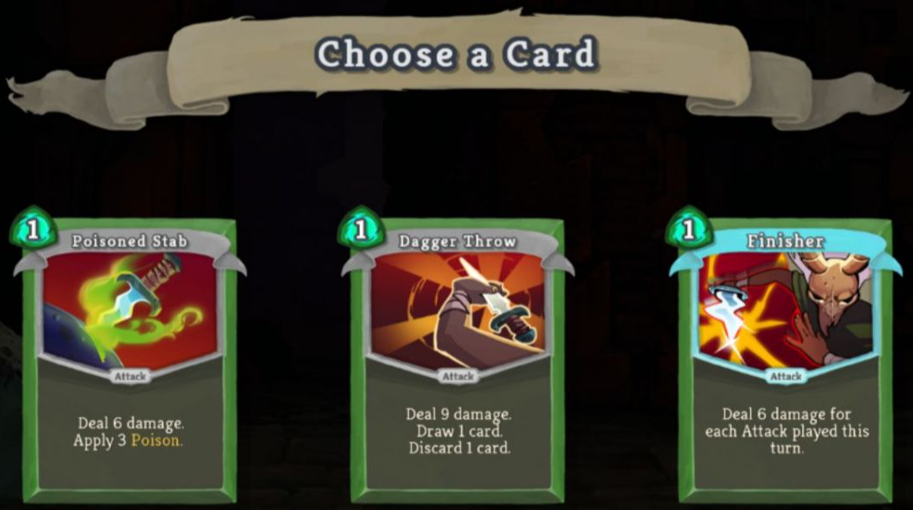

# "Slay The Spire" Card Choice Analysis

Analysis of card-choice decisions in the 2019 video game *Slay the Spire*. Estimates which card selections at the reward screen improve run outcomes, and how those effects vary by character and ascension level.

<div align="center">



</div>

**Author:** Brent Smith
**Status:** In progress — data pipeline and gold-layer tables complete, exploratory/regression analysis underway

## Research question

On the card reward screen, given the choice of cards offered, which selections improve (or worsen) run outcomes? How do these effects vary by character or ascension level?

Slay the Spire's card reward screen offers a small set of cards at various points in a run, and some picks are widely considered strong or weak by the community (Reddit, forums, tier lists), but this is rarely quantified directly against actual aggregated run outcomes. This project treats each reward screen as a choice event — the picked card plus the alternatives that were passed over — and looks for cards whose selection is associated with runs continuing further and winning more often.

## Data source

Run data comes from a public dump compiled by Jake Rabinowitz, who handled Slay the Spire's internal metrics tooling and backed up run data over roughly two years — [~77 million runs, described in this Reddit post](https://www.reddit.com/r/slaythespire/comments/jt5y1w/77_million_runs_an_sts_metrics_dump/). Each run record includes the card reward choices made (and declined) at every floor, HP/relic/gold history, run outcome, and metadata like character, ascension level, and whether the run was a standard playthrough.

## Pipeline architecture

A medallion-style pipeline (bronze → silver → gold), orchestrated with [Dagster](https://dagster.io/) and built on [PySpark](https://spark.apache.org/docs/latest/api/python/) + [Delta Lake](https://delta.io/) for local, out-of-core processing of the full dataset.

```
raw_data/landing   →  bronze_runs           one row per run, raw JSON as ingested
                   →  silver_picks          one row per card-reward pick-event (wide),
                                             filtered to standard runs, enriched with
                                             HP/relic/floor confounders
                   →  silver_card_offers    one row per card offered per pick-event
                                             (long/tidy), was_picked flag — the
                                             counterfactual "offered but not chosen"
                                             cards get their own rows here
                   →  gold_run_summary      one row per run: outcome + derived
                                             path/pick counts
                   →  gold_card_choice_events   analysis-ready copy of
                                             silver_card_offers, for the card-choice
                                             regression
                   →  gold_relic_offers     boss-relic choices, same was_picked shape
                                             as card offers
```

**bronze** ingests raw run JSON as-is (one row per run), deduplicating by `play_id` — some months' source data has overlapping rollup and per-run files that would otherwise double-count runs.

**silver** filters out non-standard runs (endless/daily/trial/seeded, and a handful of custom-mode runs with impossible floor numbers) and reshapes the nested `card_choices` field into pick-event rows. `silver_card_offers` further explodes each pick-event into one row per *offered* card (picked or not), which is what makes choice modeling possible — without the not-picked alternatives, you can only see a card's raw pick frequency, not whether it's actually associated with better outcomes.

**gold** holds the tables built for analysis: a per-run summary, the card-choice long table (`was_picked` as the choice-model target, `floors_gained`/`victory` as outcome targets), and an equivalent table for boss-relic choices. Boss relics aren't tracked with a floor in the source data the way card picks are, so `gold_relic_offers` uses `boss_relic_tier` (0/1/2 = after the Act 1/2/3 boss) in place of a floor.

Each asset is defined in `sts_pipeline/assets/` (`bronze.py`, `silver.py`, `gold.py`) and wired together in `sts_pipeline/definitions.py`.

## Notebooks

The numbered notebooks are the analysis narrative, in order:

| Notebook | Purpose |
|---|---|
| `00_problem_definition.ipynb` | Research question, data source, filtering plan, outcome metric |
| `01_data_collection.ipynb` | Initial data acquisition and shape check |
| `02_data_preparation.ipynb` | Original pandas-based cleaning/reshaping pass (superseded by the Spark pipeline, kept as reference) |
| `03_exploratory_analysis.ipynb` | Screening pass over `gold_card_choice_events` to identify cards of interest per character (pick rate, win-rate lift, floors-gained lift), ahead of per-card logistic regression |

`bronze_inspection.ipynb` and `silver_inspection.ipynb` are ad-hoc dev notebooks for eyeballing the pipeline's Delta tables — not part of the analysis sequence.

## Project structure

```
sts_pipeline/
  assets/
    bronze.py         bronze_runs
    silver.py          silver_picks, silver_card_offers
    gold.py             gold_run_summary, gold_card_choice_events, gold_relic_offers
  definitions.py       Dagster Definitions wiring the assets together
  spark_resource.py    local Spark session config (Delta Lake extensions, memory/partitions)
notebooks/              numbered analysis notebooks + dev inspection notebooks
raw_data/                landing/bronze/silver/gold data (gitignored, generated locally)
```

## Running the pipeline

Requires Python 3.13+, a local JDK 17 (`.jdk17/`, gitignored — point `JAVA_HOME` at it), and Hadoop `winutils` on Windows (`HADOOP_HOME`). Install dependencies with:

```
pip install -r requirements.txt
```

With raw run JSON placed under `raw_data/landing/`, materialize the full pipeline (omitting `--select` runs every asset, in dependency order):

```
dagster asset materialize -m sts_pipeline.definitions
```

or an individual asset:

```
dagster asset materialize -m sts_pipeline.definitions --select "gold_run_summary"
```

Notebooks read the materialized Delta tables directly from `raw_data/{bronze,silver,gold}/...` — see the setup cell at the top of any notebook for the environment variables it expects.
